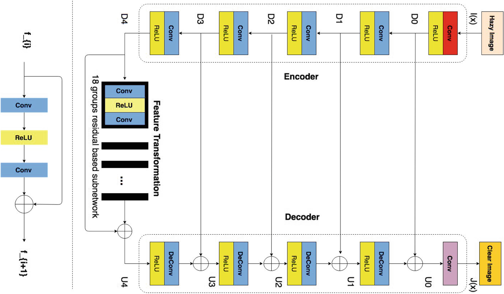
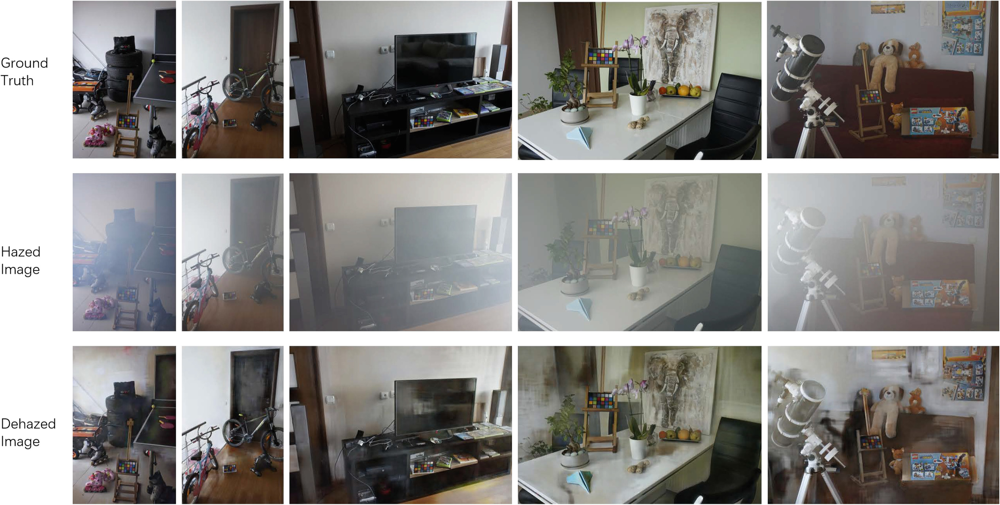
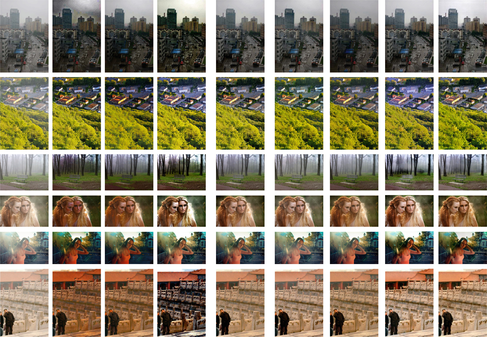

# PFFNet-PyTorch
### This repository is an official PyTorch implementation of the paper "Progressive Feature Fusion Network for Realistic Image Dehazing". 

Original link to this project: [PFFNet](https://github.com/MKFMIKU/PFFNet).

Paper can be download from <a href="https://www.jianguoyun.com/p/DSNFu1MQ19ySBxic-8oB">PFFNet</a>


PFFNet is a solution for the NTIRE2018 image defogging challenge (20.549db for Indoor and 20.230db for Outdoor), final results could be found at [NTIRE2018](http://www.kfm.cat/pdf/ntire-2018-dehazing-challenge-report.pdf). 
We won the six place and awarded "Honorable Mention Award".


Improved version was accepted by ACCV2018. 

All pretrained models can be found at: [Here](https://drive.google.com/open?id=198ZP8yV3gl49IdSZHEz9SMmTvppt_a9v)


<p align="center">

</p>


---------


## Preparation
Using data_argument.py to enchance the datasets, it will produce below datasets
```bash
$ python dara_argument.py --fold_A=IndoorTrainHzay --fold_B=IndoorTrainGT --fold_AB=IndoorTrain 

IndoorTrain
\data   hazy image
\label  clear image
```

## Train
Using default parameter to train
```bash
python train.py --cuda --gpus=4 --train=/path/to/train --test=/path/to/test --lr=0.0001 --step=1000
```

## Test
```bash
python test.py --cuda --checkpoints=/path/to/checkpoint --test=/path/to/testimages
```


## Results
<p align="center">

</p>

--------


<p align="center">

</p>


## Citation
If you use the code in this repository, please cite our paper:

```
@inproceedings{mei2018pffn,
title={Progressive Feature Fusion Network for Realistic Image Dehazing},
author={Mei, Kangfu and Jiang, Aiwen and Li, Juncheng and  Wang, Mingwen},
booktitle={Asian Conference on Computer Vision (ACCV)},
year={2018}
}
```
